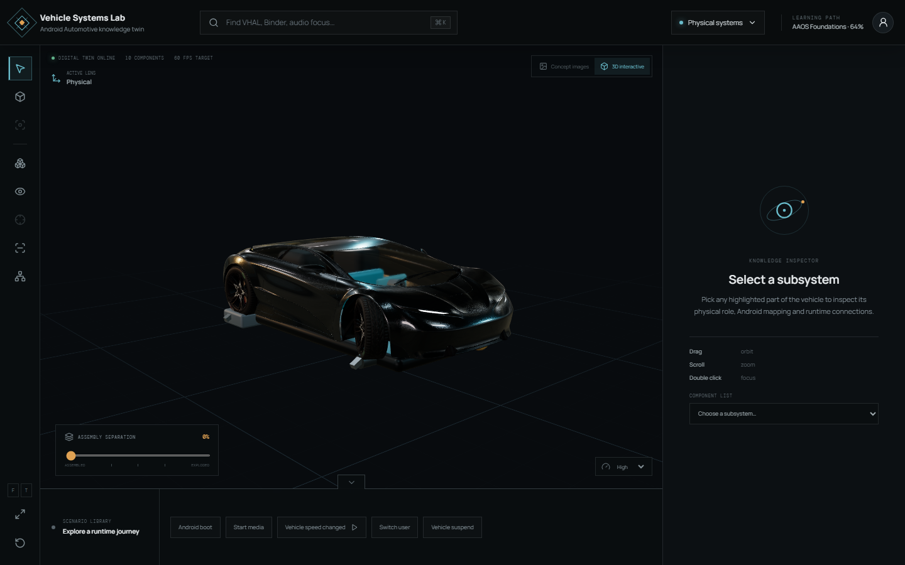

# Android Automotive Knowledge Vehicle

An interactive Android Automotive digital twin for exploring the relationship
between physical vehicle systems and Android software. The prototype is a
complete vertical slice: it renders a multi-part 3D vehicle, supports direct
manipulation, and connects the scene to learning, signal-flow, and diagnostic
content.



## Run locally

Requirements:

- Node.js 20 LTS (20.19+) or Node.js 22 LTS (22.12+)
- npm 10+
- A browser with WebGL 2

```bash
npm install
npm run dev
```

Open the local URL printed by Vite. Build a production bundle with:

```bash
npm run build
npm run preview
```

The app has a WebGL fallback: Concept Images, search, inspector, and scenario
playback remain available when WebGL 2 or the GLB renderer fails.

## Verification

```bash
npm run verify          # typecheck, lint, unit/data tests, and production build
npm run test:e2e        # Playwright browser smoke tests (run `npx playwright install chromium` once)
```

Curated data is validated during `npm run build`. The catalog includes Vehicle
speed changed, Cluster speed diagnostic, Android boot, Start media, Switch user,
and Vehicle suspend. These are simulations with source references, not live
vehicle telemetry.

## Prototype capabilities

- Orbit, pan, wheel/pinch zoom, camera presets, double-click focus, and reset
- Interactive PBR glTF exterior with real orbit, zoom, pan, selection, X-Ray,
  isolate, and exploded subsystem geometry
- AI-generated assembled, X-Ray, and exploded vehicle renders retained as an
  optional Concept Images reference lens
- Fifteen independently selectable logical components made from separate meshes
- Live in-world IVI, cluster, and passenger-display UI rendered as crisp canvas
  textures on physical 3D screens
- Selectable EV skateboard frame, traction battery modules, HV cabling, and rear
  electric drive unit
- Physical CAN and Automotive Ethernet harnesses with connectors, route nodes,
  and animated data packets in Architecture / Signal modes
- Hover highlight and tooltip; click selection and related-system dimming
- Data-driven exploded view with stable per-component vectors
- X-Ray body shell, isolate, hide, and focus actions
- Physical, Android Architecture, Signal Flow, Learning, and Diagnostic lenses
- Search for concepts such as VHAL, Binder, DisplayManager, and Audio Focus
- Right inspector with overview, architecture, runtime, source, diagnostics,
  and persistent-in-session notes
- Complete “Vehicle speed changed” signal flow with playback and step controls
- Interactive “Cluster speed is not updating” diagnostic investigation
- Learning status with both color and symbolic markers
- Responsive desktop, compact toolbar, and mobile bottom-sheet layouts
- Reduced-motion support based on the user’s OS preference

## Project architecture

```text
src/
├── app/
│   └── App.tsx
├── data/
│   ├── vehicle.ts          # component knowledge graph
│   └── scenarios.ts        # signal and diagnostic scenarios
├── features/
│   ├── component-inspector/
│   ├── scenarios/
│   └── vehicle-viewer/
│       ├── GeneratedVehicleLayer.tsx
│       └── VehicleScene.tsx
├── store/
│   └── useAppStore.ts      # UI/viewer/scenario/learning state
├── types/
│   └── index.ts            # shared data contracts
├── ui/
│   ├── ToolRail.tsx
│   └── TopBar.tsx
├── main.tsx
└── styles.css

public/
├── models/
│   ├── CarConcept.glb
│   └── CarConcept-LICENSE.md
└── visuals/
    ├── vehicle-assembled.png
    ├── vehicle-xray.png
    └── vehicle-exploded.png
```

The default **3D Interactive** presentation uses a PBR glTF exterior shell plus
separate code-native chassis, battery, drive unit, compute, live cockpit
displays, sensor, VHAL, gateway, audio, CAN, and Automotive Ethernet
components. The scene supports true camera orbit and every technical subsystem
remains independently selectable and explodable.

The optional **Concept Images** presentation uses the generated transparent
vehicle assets as a 2.5D reference surface. Hotspots, labels, and signal paths
remain live HTML/SVG interactions rather than being baked into the images.

The scene is a renderer of the knowledge data, not the owner of that data.
Mesh interaction resolves to a stable `component.id`; the store then coordinates
selection, camera focus, inspector content, signal highlighting, and learning
state. UI changes do not rebuild the scene graph.

### Component hierarchy

```text
Vehicle
├── Exterior
│   ├── Body shell
│   └── Front camera
├── Interior
│   ├── Center display
│   └── Instrument cluster
├── Compute
│   ├── IVI compute unit
│   └── Vehicle HAL
├── Vehicle systems
│   ├── Gateway ECU
│   ├── Audio amplifier
│   └── Front wheel sensor
└── Communication
    └── CAN bus
```

### State boundaries

`useAppStore` contains serializable application state:

- viewer state: mode, selection, hidden IDs, explode amount, X-Ray, isolate
- camera command: position, target, and revision
- inspector state: active tab and visibility
- scenario state: active step, playback, speed, completed diagnostic checks
- learning state: status overrides and local notes

Three.js animation-local values such as interpolation phase and object refs stay
inside scene components, preventing frame-by-frame values from causing React
renders.

## Data schemas

The TypeScript contracts are defined in `src/types/index.ts`.

### Vehicle component

```ts
interface VehicleComponent {
  id: string;
  name: string;
  shortName: string;
  category: "Exterior" | "Interior" | "Compute" | "Vehicle" | "Communication";
  description: string;
  meshNames: string[];
  parentId: string;
  position: [number, number, number];
  explodeDirection: [number, number, number];
  explodeDistance: number;
  cameraPosition: [number, number, number];
  cameraTarget: [number, number, number];
  color: string;
  androidMappings: string[];
  relatedComponents: string[];
  concepts: string[];
  sourceReferences: SourceReference[];
  diagnosticTopics: string[];
  learningStatus: LearningStatus;
  progress: number;
}
```

`position` represents the assembled transform. Exploded view calculates:

```text
display position =
  original position + explodeDirection × explodeDistance × explodeAmount
```

The result is eased each frame and remains fully reversible.

### Signal flow

```ts
interface SignalFlow {
  id: string;
  name: string;
  description: string;
  steps: Array<{
    id: string;
    componentId: string;
    label: string;
    detail: string;
    layer: "Physical" | "Transport" | "HAL" | "Framework" | "Application";
  }>;
}
```

The ordered steps are used by the timeline, 3D path, animated pulse, component
emission, and inspector. Add another flow by creating one data object with the
same contract.

### Diagnostic scenario

```ts
interface DiagnosticScenario {
  id: string;
  title: string;
  symptom: string;
  checks: Array<{
    id: string;
    componentId: string;
    label: string;
    command: string;
    result: string;
    state: "pass" | "warn" | "fail";
  }>;
  rootCause: string;
  resolution: string;
}
```

## Replacing the primitive vehicle with a GLB

The primitive vehicle intentionally uses the same logical separation expected
from a production asset. To replace it:

1. Export a GLB with separate, named meshes. Do not merge the full vehicle.
2. Put the optimized file in `public/models/vehicle.glb`.
3. Load it once with Drei’s `useGLTF`.
4. Traverse the loaded scene and build `Map<string, THREE.Object3D>` by mesh name.
5. For every `VehicleComponent.meshNames` entry, attach the matching mesh to a
   logical component group.
6. Clone and cache original materials before applying selection or X-Ray state.
7. Store each mesh’s original position, quaternion, and scale for reset.
8. Compute a `Box3` for each logical component to derive camera targets or update
   `cameraPosition` / `cameraTarget` in the data.
9. Keep animations on logical parent groups so multi-mesh components explode as
   one subsystem.

A loader adapter should expose a normalized shape such as:

```ts
type LoadedVehicle = {
  root: THREE.Group;
  componentGroups: Map<string, THREE.Group>;
  originalTransforms: Map<string, THREE.Matrix4>;
  originalMaterials: Map<string, THREE.Material | THREE.Material[]>;
  bounds: Map<string, THREE.Box3>;
};
```

The inspector, store, signal flow, and learning features do not need to change.

## Mesh naming convention

Use lowercase `snake_case`, name meshes by function rather than modeling-tool
history, and use a numeric suffix only for repeated physical pieces:

```text
body_shell_lower
body_shell_roof
glass_canopy
center_display
instrument_cluster
ivi_compute_unit
vhal_module
gateway_ecu
audio_amp
front_camera
front_wheel_sensor
can_bus_lines
speaker_front_left_01
```

Multiple mesh names can map to the same logical component. Avoid names such as
`Cube.004`, deeply tool-specific prefixes, spaces, and full-vehicle merged
meshes.

## Performance choices

- Materials are stable React nodes rather than allocated inside `useFrame`.
- Explode and signal pulse animation use object refs, avoiding state writes per
  frame.
- Quality controls adjust DPR, shadows, environment, and antialiasing.
- Contact shadows are disabled on Low.
- The production bundle separates the Three.js engine from React and app code.
- Heavy future learning/code content should be loaded per inspector tab.

## Current limitations

- Concept Images is a 2.5D reference view and cannot rotate to novel angles;
  use 3D Interactive for all spatial inspection.
- The exterior is a generic concept-car shell, not an OEM-specific production
  vehicle. Android Automotive modules are project-specific overlays.
- Section-cut/clipping planes and screenshot export are not included in this
  vertical slice.
- X-Ray transparency is preset rather than exposed as a second opacity slider.
- Search uses an in-memory index; source paths are reference data, not a code
  browser.
- Mobile supports navigation and viewing, but dense diagnostic analysis remains
  best on desktop.

## Recommended next steps

1. Add the GLB adapter above and use Draco/Meshopt-compressed production assets.
2. Add an authenticated learning-profile service when cross-device sync is required.
3. Implement movable X/Y/Z clipping planes and a visible section indicator.
4. Split large scenario content into lazy-loaded JSON/MDX packages as the catalog grows.
5. Add more signal-flow scenarios using the topology-aware CAN/Ethernet routes.
6. Expand browser accessibility and visual-regression coverage beyond the current smoke suite.
7. Add screenshot export; shareable URLs already cover mode, presentation, selection, scenario, and step.
8. Profile representative integrated-GPU hardware and define adaptive quality
   thresholds.

## 3D asset attribution

The exterior shell uses **Car Concept** from the Khronos glTF Sample Assets
collection, adapted at runtime by recoloring the paint and separating the
exterior from the project-specific technical chassis.

- Model and textures: Eric Chadwick / Darmstadt Graphics Group GmbH
- License: Creative Commons Attribution 4.0 International
- Source: <https://github.com/KhronosGroup/glTF-Sample-Assets/tree/main/Models/CarConcept>
- Local license copy: `public/models/CarConcept-LICENSE.md`

See `CREDITS.md` for full project attribution.
